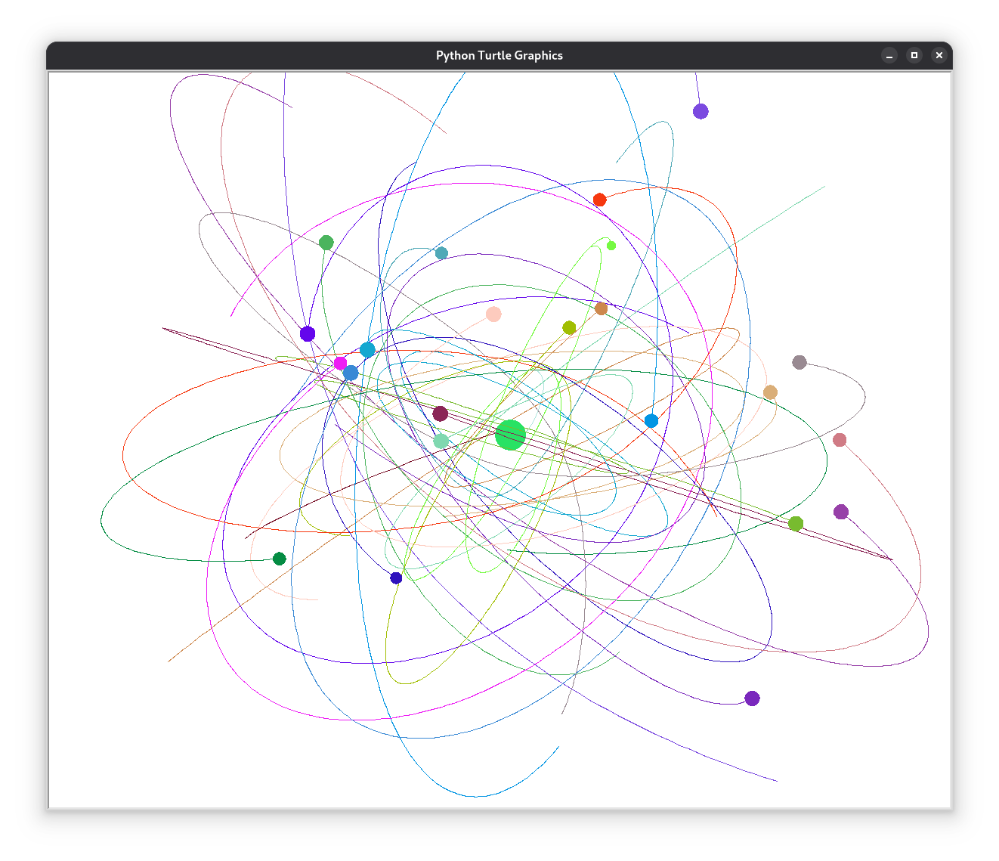

# Celestial Physics Simulation - Planetary Observatory (Python)

> This project was first developed in 2015 and later published in 2025.

A simple 3D n-body simulation.



## Requirements

 - python3-tkinter

## Quick Start
```
python3 ./CPS-PlanetaryObservatory.py
```
